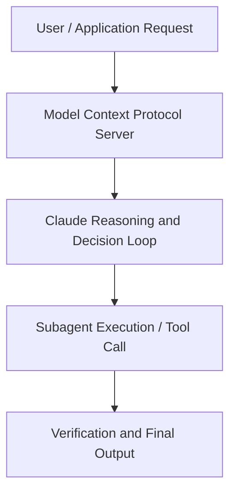

# Transforming Financial Analysis at Scale: How BCI Leverages Claude's Financial Analysis Solution

**Speaker(s):** Anthropic and Partner Leaders · **Channel:** Unlisted Videos · **Date:** 2025-10-23
**Watch:** https://youtu.be/KbrNYPjXb48 · **Format:** Talk · **Level:** Advanced
**Topics:** Web Development, AI Coding Tools

## TL;DR
This session explores transforming financial analysis at scale: how bci leverages claude's financial analysis solution, highlighting core architecture, runtime workflows, and practical deployment patterns across Web Development, AI Coding Tools. Speakers analyze technical implementations and share operational best practices for building robust systems with Anthropic, Artifacts.

## Contents
- [Architecture and Core Concepts in Transforming Financial Analysis at Scale: How](#architecture-and-core-concepts-in-transforming-financial-analysis-at-scale-how)
- [Technical Mechanics, Implementation Patterns, and Tooling](#technical-mechanics-implementation-patterns-and-tooling)
- [Operational Workflows, Evaluation, and Production Scaling](#operational-workflows-evaluation-and-production-scaling)
- [Strategic Implications, Governance, and Key Takeaways](#strategic-implications-governance-and-key-takeaways)

## Architecture and Core Concepts in Transforming Financial Analysis at Scale: How

Good morning, good afternoon, maybe good evening to some of you depending on where you are. I'm really excited for for this hour that we have. We'll be showcasing today how BCI transforms financial analysis with Claude and I'm thrilled to introduce our
speakers today. We have Nicholas Lynn who's the product lead for financial services here at Anthropic and Ben Leilik who's the senior director of
digital transformation and innovation at BCI which is one of Canada's largest institutional investors. Before we dive
in, I have a few uh quick housekeeping items. Don't be afraid if you're going to miss something from the webinar. There will be a recording
and we'll make sure to distribute this via email within 24 hours. If you have any questions, don't wait till the end.

**Further reading:** Official documentation for Anthropic and Anthropic platform guides.

## Technical Mechanics, Implementation Patterns, and Tooling

Over 84% of
s, 16 secondsour assets are internally managed uh inhouse uh but we also do have a lot of great fund partners. We represent
s, 23 secondsboth kind of you know that direct investor uh type type of work here, but we're also an LP uh and we do a lot of co-investments with our fund partners. S, 32 secondsSo I'm going to show you an examples of of a few of those things today during the demo. I would say it's just a huge responsibility managing all this
s, 41 secondsmoney and at the end of the day it's a lot of money. It's literally hundreds of millions of dollars under management per
s, 48 secondsemployee especially if you consider you know the front office uh manages money and the back office is maybe half of that. Um you know these are very
s, 57 secondshigh-erforming very curious people. We have great support from the top of the house to be able to use these types of
s, 4 secondstools. Um you know generally I say everyone is still responsible for their own output right like even though the AI is is great and it gives us great
s, 13 secondsanswers at the end of the day what you're putting forward puts your name on it.

**Further reading:** Official documentation for Anthropic and Anthropic platform guides.

## Operational Workflows, Evaluation, and Production Scaling

But you can still, you know, like any good coach or or manager, you can give it a
s, 2 secondslittle bit more uh help. Save me a lot of time. S, 6 secondsHowever, the charts didn't turn out well. Basically the x's and y axis aren't really working. So, can you kind of do it again and and fix the charts
s, 14 secondsbecause uh it looks like maybe you're just not, you know, I think it was just there was a blank row um somewhere and it just didn't catch that. So, here we
s, 23 secondsare again. I'm not 100% sure why it wanted to make them all brown. These are now
s, 32 secondsmaking charts that uh I asked it for, which is which is really cool.

**Further reading:** Official documentation for Anthropic and Anthropic platform guides.

## Strategic Implications, Governance, and Key Takeaways

How has their feedback which has been incredible to date shaped the financial analysis solution so far? You know, we have a set of what we call hypotheses of problems that we want to work on internally. You
s, 38 secondsknow, I've spent my career in finance, but the last few years in tech. So, you know, I have my own perspective of what these AI systems are capable of solving. S, 49 secondsBut the beauty of these systems is that they are very powerful and we learn so much from deploying these systems in the
s, 57 secondswild especially with our customers. A very close partnership with BCI and others is really the only way for us to
s, 6 secondscontinue to shape our products and our models. Having a early and often you know conversation with our customers
s, 14 secondsdirectly is a really critical part of both our product and our research strategy. We do a number of
s, 22 secondsdesign partnerships obviously and VCI is one of our core design partners.

**Further reading:** Official documentation for Anthropic and Anthropic platform guides.

## Source
Full cleaned transcript: `DATA/videos/transforming-financial-analysis-at-scale-how-2025.json`
Canonical recording: https://youtu.be/KbrNYPjXb48