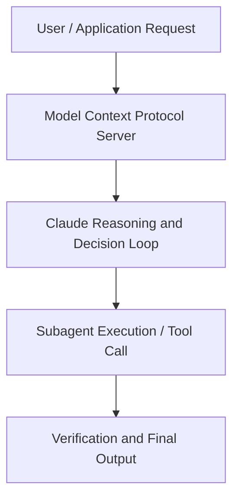

# Transforming the world's largest sovereign wealth fund with AI: NBIM’s journey with Anthropic

**Speaker(s):** Anthropic and Partner Leaders · **Channel:** Unlisted Videos · **Date:** 2025-05-27
**Watch:** https://youtu.be/tWaEqH_gxro · **Format:** Demo · **Level:** Intermediate
**Topics:** Product/Startup, Web Development

## TL;DR
This session explores transforming the world's largest sovereign wealth fund with ai: nbim’s journey with anthropic, highlighting core architecture, runtime workflows, and practical deployment patterns across Product/Startup, Web Development. Speakers analyze technical implementations and share operational best practices for building robust systems with Anthropic, Artifacts.

## Contents
- [Architecture and Core Concepts in Transforming the world's largest sovereign we](#architecture-and-core-concepts-in-transforming-the-worlds-largest-sovereign-we)
- [Technical Mechanics, Implementation Patterns, and Tooling](#technical-mechanics-implementation-patterns-and-tooling)
- [Operational Workflows, Evaluation, and Production Scaling](#operational-workflows-evaluation-and-production-scaling)
- [Strategic Implications, Governance, and Key Takeaways](#strategic-implications-governance-and-key-takeaways)

## Architecture and Core Concepts in Transforming the world's largest sovereign we

We're thrilled to have you here today for our 60-minute webinar to highlight MBIM's journey with
anthropic in AWS and more practically how you watching can apply generative AI in your enterprise to drive drive real
value. A couple items for housekeeping before we jump into it. A recording of the session will be sent to you, so
don't sweat that. It'll be distributed via email, so be on the lookout. Questions, and of course, we want to hear from you. You can submit in the widget in the webinar portal. Even for those questions we
want to have a chance to get through today, we are very committed to following up with you to get to as best we can. Then feedback, of course, we
always want to make these as valuable for you as possible.

**Further reading:** Official documentation for Anthropic and Anthropic platform guides.

## Technical Mechanics, Implementation Patterns, and Tooling

Now with that said, uh on to the main event,
s, 15 secondsuh our friends at MBIM. I want to be do a big shout out and introduction for Stion and Regina who I will let take it
s, 23 secondsaway from here to walk through how they practically implemented in this case Claude and G our geni solutions across
s, 31 secondstheir whole firm to drive a lot of transformation. With that said Regina do you want to take it away? S, 42 secondsHi everyone to talk about AI but I think it's really important that we start to talk about a little bit who we are. I
s, 50 secondswon't go into detail as certain some of you know us already but I think it makes sense. In very very short uh the fund
s, 58 secondsNBA is the piggy bank of Norway. It's a fund owned by the Norwegian people. And it's actually the oil revenues from
s, 7 secondsthe North Sea being exported.

**Further reading:** Official documentation for Anthropic and Anthropic platform guides.

## Operational Workflows, Evaluation, and Production Scaling

I just use the uh the CLA app. I actually
s, 8 secondsuse it all the time, too. And uh my 16-year-old son is now in the exam period, and he's got a lot of oral
s, 15 secondsexams, and we use Cloud every night now to find small nud nuggets of information that he can use to get those grade ups. S, 22 secondsSo, um hopefully in a couple of weeks, I can to let you know that has actually helped him get into the next school. The next thing I just want to mention is that I also have an 11-year-old and uh he was in the office a few weeks ago and I didn't know what
s, 37 secondsto do really with him because I had a call. I said to him, "Hey, go play with Claude. Just go now." We're talking about, you know, it
s, 44 secondstook us about a year to make him carry his own shoelaces. But in in 15 minutes when I had the call, he and Claude had created a very basic computer program.

**Further reading:** Official documentation for Anthropic and Anthropic platform guides.

## Strategic Implications, Governance, and Key Takeaways

How do you balance the need for moving fast and being applying this technology in innovative ways with
s, 27 secondsensuring the stringest the most stringent security and compliance requirements? Ste, why don't we start with you? S, 36 secondsUm in we we do label our data with different confidentiality levels depending on you know
s, 44 secondssensitivity. And whenever we share or send data through external system we we
s, 51 secondsalways do a security assessment of the vendor the system and any dependency related to it. The more sensitive
s, 59 secondsdata of course the more thorough the assessment will be. For us it's it's really important that the vendor has uh maturity and solid principles in place. S, 9 secondsFor as an example the uh principle AWS has that a person replacing faulty hardware does not know which customer
s, 17 secondsthat hardware belongs to. With regards to AI, it's it it's important to to also to
s, 26 secondsknow what data is retained if any and how any retain data is secure.

**Further reading:** Official documentation for Anthropic and Anthropic platform guides.

## Source
Full cleaned transcript: `DATA/videos/transforming-the-worlds-largest-sovereign-wealth-2025.json`
Canonical recording: https://youtu.be/tWaEqH_gxro