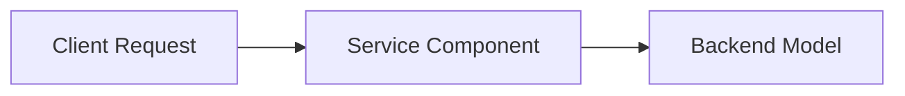

# Curation Pipeline

This document explains the standard workflow for ingesting, cleaning, validating, and publishing technical talks.

---

## 1. Pipeline Overview

The curation process converts conversational YouTube transcripts into structured, high-signal knowledge assets through four disciplined phases:

```
[ Phase 1: Intake & Normalize ]
  Raw video metadata, speaker attribution, and timestamped transcripts.
               │
               ▼
[ Phase 2: Build DATA JSON ]
  De-fluff verbal noise, segment by topic shifts, extract entities, compute read time.
               │
               ▼
[ Phase 3: Build INFO Study Note ]
  Author executive TL;DR, draw Mermaid architecture diagrams, define jargon inline.
               │
               ▼
[ Phase 4: Rebuild Manifests & Index ]
  Regenerate DATA/manifest.jsonl, INFO/index.md, and update README.md metrics.
```

---

## 2. Transcript De-Fluffing Standards

Spoken technical presentations contain repetitive conversational filler. When editing segment text:

- **Remove**: False starts, pleasantries ("Can you hear me?", "Next slide please"), verbal pauses ("um", "you know"), repetitive jokes, and technical audio test chatter.
- **Preserve in Full**: Specific technical terms, benchmark numbers, architectural claims, hardware models, code snippets, reasoning steps, and non-trivial anecdotes.

---

## 3. Study Note Formatting

Every file in `INFO/{channel-slug}/{id}.md` must follow this exact markdown layout:

```markdown
# <Title of Talk>

**Speaker(s):** <Speaker 1, Speaker 2> · **Channel:** <Channel Name> · **Date:** <YYYY-MM-DD>
**Watch:** <YouTube URL> · **Format:** <Format> · **Level:** <Level>
**Topics:** <Topic 1, Topic 2>

## TL;DR

2 to 3 concise sentences summarizing the core architectural takeaways.

## Contents

- [Heading 1](#heading-1-slug)
- [Heading 2](#heading-2-slug)

---

## Heading 1

Detailed conceptual breakdown. Introduce complex jargon with inline definitions on first use.



---

## Source

Full cleaned transcript: `DATA/videos/{id}.json`
Raw transcript: `RAW/videos/{id}.md`
```

---

## 4. Verification and Index Rebuilding

Always run validation before committing new additions:

```bash
# 1. Run strict schema, link, and style checks
python .claude/tools/check.py

# 2. Rebuild manifest and index files
python .claude/tools/rebuild_all_indexes.py

# 3. Update README catalog tables and metrics
python .claude/tools/update_readme.py
```
